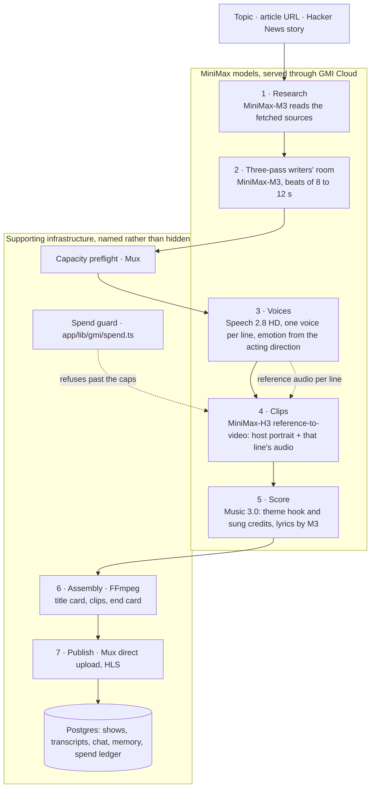

# Interdimensional Cable

### An autonomous AI showrunner: any topic in, a late-night comedy episode out

**Built for [MiniMax Week × GMI Cloud](https://www.gmicloud.ai/minimax-week) (Aug 24 to Sep 6, 2026). Track: Synthesis, "agents that direct".**

Pick a late-night format, give it a topic or a link, and a durable workflow researches it, writes it in a three-pass writers' room, performs every line, renders the host on camera, scores a theme, sings the credits and publishes a 60 to 120 second video episode (or an audio podcast up to five minutes), unattended. Four MiniMax models do the creative work, all served through GMI Cloud: **MiniMax-M3** writes and directs, **Speech 2.8 HD** performs, **MiniMax-H3** renders each clip from the host's portrait and that line's audio, and **Music 3.0** composes the theme and the credits. The host then answers questions in character, remembers what you asked, and a coordinator can pick tomorrow's episode from Hacker News on its own.

---

## What you will see in 60 seconds

**Hero episode (All In Like, 4 min audio, created on the live site and rendered by the worker):** https://minimax-week-interdimensional-cable.vercel.app/watch/2752c892-9b8d-418c-9e29-207d8a11106c

**Spend for that episode:** $0.00. MiniMax-M3, Speech 2.8 HD and Music 3.0 were free during MiniMax Week and no MiniMax-H3 request was made. The H3 path is implemented (reference-to-video, spend guard) but none of the submitted episodes use it.

**Audio episode on the free models (2:12):** https://player.mux.com/9n00bwSpEQVU003A3v02r8PLMi5oOAv4p01lQNtqWSH2VlU. Two hosts, nine turns voiced by Speech 2.8 HD with per-line emotion, an 8 s theme and a 15 s sung credits recap by Music 3.0, all written by MiniMax-M3 from a one-line topic about smart fridges joining botnets. No MiniMax-H3 request was needed, so it cost nothing.

1. A title card with a theme hook Music 3.0 recorded for this episode, in the show's voice.
2. The host, rendered by MiniMax-H3 from one portrait, delivering each line in a Speech 2.8 HD voice with the emotion the script asked for. Same face, same desk, same voice, every clip.
3. Jokes written by MiniMax-M3 from sources it actually read, not from a vibe. The watch page lists them.
4. End credits that sing the episode's three best jokes back to you.
5. A chat box where the host answers in character, in its own voice, and a memory card that shows what the show has learned about you.

---

## How it works

Every stage is a checkpointed step in a Vercel Workflow (`workflows/generate-show.ts`). A failed step resumes from the last completed one instead of starting over, and every intermediate result lands in Postgres as it arrives.



Video path: research, script, voices, generate-clips, music, stitch, upload. Audio path: research, script, voices, music, stitch, upload. Show statuses as they advance: `researching`, `scripting`, `voicing`, `generating`, `scoring`, `stitching`, `uploading`, `ready`.

---

## Model map

Every model call in the product goes through one shared layer, `app/lib/gmi/`, so the model id, the key scope and the retry policy live in exactly one place.

| Model                                                                                          | Served through                                                            | What it does here                                                                                                                                                                                                                                                                                                                     | File                                                                                                                                              |
| :--------------------------------------------------------------------------------------------- | :------------------------------------------------------------------------ | :------------------------------------------------------------------------------------------------------------------------------------------------------------------------------------------------------------------------------------------------------------------------------------------------------------------------------------ | :------------------------------------------------------------------------------------------------------------------------------------------------ |
| **MiniMax-M3** (`MiniMaxAI/MiniMax-M3`, 1M context, free during MiniMax Week)                  | GMI Cloud LLM endpoint, via the Vercel AI SDK provider `@ai-sdk/gmicloud` | Grounded research on fetched sources (Hacker News search and article pages); the three-pass writers' room (`pass1-research`, `pass2-head-writer` with 8 to 12 s beats, `pass3-voice-prune`); memory extraction; in-character chat and tangents; the Taskmaster's story ranking; summaries of imported talks; theme and credits lyrics | `app/lib/gmi/text.ts`, `app/lib/dramaturgy/`, `app/lib/memory-bank.ts`, `app/watch/[showId]/chat/actions.ts`, `scripts/autonomous-trend-agent.ts` |
| **MiniMax-H3** (video, 4 to 15 s per clip, 768P or 2K, $0.13 per request, the only paid model) | GMI Cloud request queue (`console.gmicloud.ai/api/v1/ie/requestqueue`)    | Every clip of a video episode, in reference-to-video mode: the show's host portrait as a reference image and that line's Speech 2.8 audio as reference audio. Content refusals surface as `GmiContentFilterError` so the line can be revised and retried                                                                              | `app/lib/gmi/video.ts`, driven by `workflows/generate-show.ts`; spend guard in `app/lib/gmi/spend.ts`                                             |
| **Speech 2.8 HD** (`minimax-tts-speech-2.8-hd`, free during the week)                          | GMI Cloud request queue                                                   | One voice per line, emotion mapped from the script's acting directions, a fixed voice per host persisted on the show; the podcast format (audio episodes up to 5 min); live chat replies and audio tangents                                                                                                                           | `app/lib/gmi/speech.ts`, `app/lib/tts.ts`, voice catalog in `app/lib/gmi/voices.ts`                                                               |
| **Music 3.0** (`minimax-music-3.0`, free)                                                      | GMI Cloud request queue                                                   | A theme hook in the show's voice and an end-credits song that sings the episode's three best jokes, both rendered per episode and mixed under a title card and an end card                                                                                                                                                            | `app/lib/gmi/music.ts`, mixed by `app/lib/assemble.ts`                                                                                            |
| **Voice clone 2.8 HD** (`minimax-audio-voice-clone-speech-2.8-hd`)                             | GMI Cloud request queue                                                   | Wired and optional: clone a voice from a sample and speak a line with it                                                                                                                                                                                                                                                              | `app/lib/gmi/speech.ts` (`cloneVoiceAndSpeak`)                                                                                                    |

Shared plumbing: `app/lib/gmi/client.ts` (one key, both GMI surfaces, 429 and 5xx retry), `app/lib/gmi/queue.ts` (submit, poll, download), `app/lib/gmi/upload.ts` (portraits and audio lines become public URLs for H3).

Supporting infrastructure, deliberately not MiniMax and named as such: **Vercel Workflow DevKit** (durable, checkpointed steps), **Postgres with Drizzle** (`db/schema.ts`; full-text search replaced the old embeddings), **Mux** (direct upload, HLS playback), **FFmpeg** (assembly), **Next.js 16**.

---

## How far the models are pushed

- **Reference-audio performances.** H3 accepts reference images and reference audio, but not together with first and last frames, so continuity is carried by anchors rather than frame chaining: every clip gets the host's portrait plus that exact line as spoken by Speech 2.8 HD, and the prompt asks the host to perform the attached line in sync. The host keeps one face, one desk and one voice across an 8 to 12 clip episode. `H3_AUDIO_STRATEGY` selects `reference` (default), `native` (H3 voices the line itself) or `overlay` (the Speech 2.8 line always replaces the clip's track); a silent clip always falls back to the overlay.
- **Per-line emotion.** The writers' room attaches an acting direction to every line; the voice stage maps it onto Speech 2.8's emotions (`calm`, `happy`, `sad`, `angry`, `fearful`, `disgusted`, `surprised`) and synthesizes each line on its own, which is also what lets a four-seat panel keep four distinct voices. Voices are assigned once and stored on the show (`voice_assignments`), so a retry never recasts the host.
- **Beats planned for the video model.** The head writer drafts in 8 to 12 second beats, the window where H3 stays sharp, and the voice pass prunes to the exact runtime. Beat durations are clamped to H3's 4 to 15 s range before submission, never silently truncated after.
- **A show that scores itself.** M3 writes a theme hook in the show's own voice and an end-credits song built from the episode's three best jokes, with Music 3.0's structure tags; Music 3.0 renders both per episode, and the watch page shows the lyrics it was given.
- **M3 as the whole writers' room.** Research reads fetched sources whole (the 1M context makes that cheap), the head writer and the voice pass are separate calls with separate briefs, and structured output is validated with Zod with one repair round that feeds the validation error back (`generateJson`). M3's reasoning is stripped before parsing.
- **A spend guard, not a spend hope.** H3 is the only paid model. Every submission is written to the `gmi_spend` ledger before it is sent, so a crash after submission still counts. Two caps, both refusing rather than degrading: `H3_MAX_REQUESTS_PER_RUN` (default 14) and `H3_SESSION_CAP_USD` (default $8 for this database).
- **The honesty rule.** No canned content on failure. An article that cannot be read fails the run instead of being invented, an empty model reply throws with the finish reason, a refused clip gets a rewritten line and a retry rather than a stock shot, and a failed step stores its real reason on the show for the UI to display. A fallback that silently substitutes fake data is worse than a crash.

---

## Run it yourself

### Prerequisites

- Node 24 (`.nvmrc` pins 24.11.0)
- `ffmpeg` on PATH (`brew install ffmpeg`); a static build is bundled for serverless hosts
- PostgreSQL 14 or newer. No extensions needed.
- A GMI Cloud account with a funded API key. MiniMax-H3 is paid ($0.13 per request); M3, Speech 2.8 HD and Music 3.0 are free during MiniMax Week.
- Mux credentials. The free plan caps stored assets at 10; the workflow preflights capacity and refuses to start when the library is full.

### Environment

`cp .env.example .env.local` and fill in the blanks. Every variable is validated at startup by `app/lib/env.ts`, which carries the exact description of each.

| Variable                                         | Required           | Purpose                                                                               |
| :----------------------------------------------- | :----------------- | :------------------------------------------------------------------------------------ |
| `GMI_CLOUD_APIKEY`                               | yes                | One key for every MiniMax model call. Optional only when visitors bring their own.    |
| `GMI_TEXT_MODEL`                                 | no                 | Text model id on GMI Cloud. Default `MiniMaxAI/MiniMax-M3`.                           |
| `H3_RESOLUTION`                                  | no                 | `768P` (default) or `2K`.                                                             |
| `H3_AUDIO_STRATEGY`                              | no                 | `reference` (default), `native` or `overlay`.                                         |
| `H3_MAX_REQUESTS_PER_RUN`                        | no                 | Per-show cap on H3 requests. Default 14.                                              |
| `H3_SESSION_CAP_USD`                             | no                 | All-time H3 spend cap for this database, in USD. Default 8.                           |
| `DATABASE_URL`                                   | yes                | Postgres. Shows, transcripts, chat, memory and the spend ledger.                      |
| `MUX_TOKEN_ID`, `MUX_TOKEN_SECRET`               | yes                | Direct upload and HLS playback.                                                       |
| `MUX_ASSET_LIMIT`                                | no                 | Stored-asset cap for your Mux plan. Default 10, the free-plan cap.                    |
| `REQUIRE_USER_API_KEYS`, `KEY_ENCRYPTION_SECRET` | public deployments | Visitors supply their own GMI Cloud key, encrypted at rest for the life of their run. |
| `NEXT_PUBLIC_BASE_URL`                           | no                 | Base URL for public endpoints and workflow callbacks.                                 |
| `REMOTION_AWS_*`                                 | no                 | Legacy social clips. Not on the show path.                                            |

### Commands

```bash
npm install
npm run db:migrate           # Drizzle migrations, including the MiniMax Week schema
npm run seed-templates       # the show formats and their hosts
npm run gmi:smoke            # prove access: M3 text + JSON, two Speech 2.8 voices, a Music 3.0 hook (all free)
npm run gmi:smoke -- --video # plus two 4 s MiniMax-H3 clips ($0.26), with and without references
npm run gmi:smoke -- --voices # plus one line in every catalog voice
npm run dev                  # http://localhost:3000
npm run dev:hosted           # the same, pointed at VERCEL_DATABASE_URL (the deployed site's database)
npm run worker               # the render worker: renders shows the deployed site queued (see DOCS/deploy.md)
npm run vercel:env-push      # push the secrets from .env.local to the linked Vercel project, without printing them
npm run agent:taskmaster     # the autonomous coordinator: Hacker News -> memory profile -> dispatch
npm run import-mux-assets    # import existing Mux assets as browsable talks
npm test                     # vitest
npm run lint && npm run build
npm run remotion:studio      # legacy social clips only
```

The smoke script appends what the platform actually returned (timings, durations, whether a clip carried audio) to `DOCS/gmi-contracts.md`, so the audio strategy decision is recorded, not remembered. H3 spend is tracked in the `gmi_spend` table; `DOCS/spend-ledger.md` is the human-readable copy.

---

## 3-minute demo

The full run sheet, with what to click, what to say, captions for muted viewers, the X post and a rehearsal timer, is `DOCS/demo-run-sheet.html` (open it in a browser). The shape:

| Time | Beat | On screen |
| :-- | :-- | :-- |
| 0:00 | Cold open: the result first | A finished episode already playing; five seconds of the hosts arguing |
| 0:12 | The pitch | Homepage headline and the "Running on MiniMax-M3 · MiniMax-H3 · Speech 2.8 HD · Music 3.0, served through GMI Cloud" strip |
| 0:32 | Make one, live | `/create`: All In Like, "Steve Jobs' investment in Pixar", audio episode, 4 min, new to this, Create |
| 1:00 | It renders (time-lapse) | The progress page naming each model as it works; the GMI Cloud chips light up |
| 1:30 | Watch it | Theme song, one exchange, the transcript following |
| 1:55 | Talk to the hosts | Live Host Q&A: a question, the in-character answer, the spoken reply or a 30 s tangent |
| 2:25 | It remembers you | The Agent Memory Bank card |
| 2:45 | The receipt, then the link | "How this was made", then the repo |

The create step on the deployed site queues the show for the render worker (`npm run worker` beside `npm run dev:hosted`), because a Vercel function stops at 300 s and a single voice line can wait five minutes in GMI's queue. Record the whole wait; the edit speeds it up.

---

## Provenance

This architecture was started on 2026-08-29 for another event, on Google's stack (Gemini for text and speech, Veo for video, Google embeddings on Cloud SQL): [arjunlohan/multimodal-frontier-hackathon-interdimensional-cable](https://github.com/arjunlohan/multimodal-frontier-hackathon-interdimensional-cable). During MiniMax Week it was rebuilt on MiniMax models end to end: every model call now goes through `app/lib/gmi/`, the Google SDK is out of the dependency tree, and the embeddings were replaced by Postgres full-text search. The 60 to 120 second video episodes, the theme music, the sung credits and the reference-audio performances are new to this week. The writers' room structure, the memory bank, the in-character chat and the Taskmaster coordinator carried over and were re-pointed at MiniMax-M3.

---

## Known limitations

Stated up front rather than left to be discovered:

- **Single tenant.** `"default_user"` is hardcoded. There is no auth; every session shares one memory profile.
- **Mux free plan caps at 10 assets.** The workflow runs a capacity preflight and refuses to start rather than spend render money it cannot store, but you must delete shows to keep generating.
- **MiniMax-H3 is paid and rate limited.** $0.13 per request, and GMI Cloud rate-limits H3 per hour; the client backs off on 429 and the spend guard refuses past the caps. A 90 second episode is roughly 8 to 12 requests. Clips render sequentially, so an episode takes minutes.
- **Workflow run store.** Off Vercel, the Workflow DevKit persists runs to the local filesystem. Deploy to Vercel for a durable queue.
- **Voice cloning is wired but off.** `cloneVoiceAndSpeak` exists; no show format uses it yet.

---

## License

MIT. See `LICENSE`.
